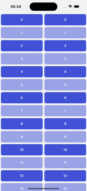
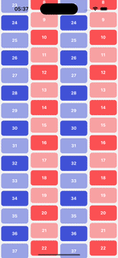
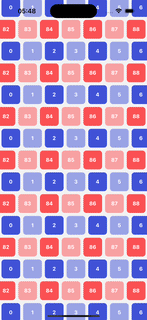

**Super lightweight and fast scroll-syncing utility for React Native**

Synchronize scroll positions between multiple scrollable components — `ScrollView`, `FlatList`, and `SectionList` — with a super simple API, zero dependencies, and buttery 60fps performance.

---

## ✨ Highlights

- 🧩 **Perfect for collapsible headers**, tab views, or split layouts
- 🧘‍♂️ **Flexible** — from simple synced lists to advanced animated layouts
- ⚡️ **Full JavaScript** — no native code, no linking
- 📱 **Expo Go** compatible
- 🧵 **Works with** `ScrollView`, `FlatList`, and `SectionList`
- 🧠 **Dead simple API**
- 🛡️ **Fully typed in TypeScript**
- 🪶 **Lightweight** — a single file (~300 lines)
- 💨 **Smooth 60fps scroll syncing**
- 📦 **Zero dependencies**

---

## 📦 Installation

```sh
npm install react-native-scroll-sync
# or
yarn add react-native-scroll-sync
# or
bun install react-native-scroll-sync
```


## 🔧 Usage

### 🟢 Basic example

```tsx
import { ScrollView } from 'react-native-scroll-sync';

export default function MyComponent() {
  return (
    <>
      <ScrollView>
        {/* ScrollView A */}
      </ScrollView>

      <ScrollView>
        {/* ScrollView B */}
      </ScrollView>
    </>
  );
}
```

### ⚙️ Advanced usage (with props)
Use `syncKey` to group views explicitly, `syncInterval` to control the active sync range, and `syncType` to define how views synchronize.

```tsx
import { ScrollView, FlatList, SectionList } from 'react-native-scroll-sync';

export default function MyComponent() {
  return (
    <>
      <ScrollView syncKey="myGroup" syncInterval={[0, 1000]}>
        {/* ScrollView content */}
      </ScrollView>

      <FlatList
        syncKey="myGroup"
        syncInterval={[0, 1000]}
        data={[1, 2, 3]}
        renderItem={({ item }) => <Text>{item}</Text>}
      />

      <SectionList
        syncKey="mySecondGroup"
        syncType="relative"
        syncInterval={[0, 500]}
        sections={[{ title: 'A', data: ['x', 'y'] }]}
        renderItem={({ item }) => <Text>{item}</Text>}
        renderSectionHeader={({ section }) => <Text>{section.title}</Text>}
      />
    </>
  );
}
```

## 🧾 Props

All components expand the props of the original component.

| Prop           | Type                         | Default      | Description                                                                                                                                                                                                                                                 |
| -------------- | ---------------------------- | ------------ | ----------------------------------------------------------------------------------------------------------------------------------------------------------------------------------------------------------------------------------------------------------- |
| `syncKey`      | `string`                     | `undefined`  | Identifier used to group multiple scroll views together                                                                                                                                                                                                     |
| `syncInterval` | `[number, number]`           | `undefined`  | Scroll range (in pixels) within which synchronization should apply                                                                                                                                                                                          |
| `syncType`     | `'absolute'` \| `'relative'` | `'absolute'` | Defines how synced views react inside the sync interval:<br>• `'absolute'`: all views match the same scroll offset<br>• `'relative'`: each view scrolls **relative to its current position**<br><br>🔁 Only takes effect **when `syncInterval` is defined** |


- 🔑 Views with the same syncKey will scroll together. 
- 📏 syncInterval prevents syncing outside of the specified vertical range (e.g. [0, 1000]).
- ⚙️ Use syncType with syncInterval to fine-tune how scroll positions are aligned or compensated.

## Contributing

See the [contributing guide](CONTRIBUTING.md) to learn how to contribute to the repository and the development workflow.

## License

MIT

---

Made with [create-react-native-library](https://github.com/callstack/react-native-builder-bob)
